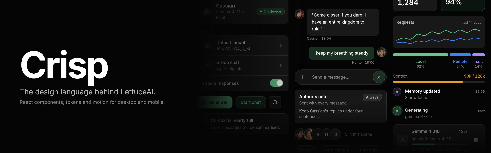

<p align="center"></p>

# Crisp

Crisp is LettuceAI's React component library. It provides application layouts, form controls, navigation, overlays, and media components, with shared design tokens and motion presets.

Components are written in TypeScript and styled with Tailwind CSS v4. Themes support light and dark palettes, custom colors, corner radii, and compact density.

## Install

```sh
bun add @lettuceai/crisp
```

Your application must also provide these peer dependencies:

| Package | Required version |
| --- | --- |
| `react`, `react-dom` | 19 or later |
| `tailwindcss` | 4 or later |
| `framer-motion` | 12 or later |
| `lucide-react` | 1 or later |

## Setup

Crisp requires a working Tailwind CSS v4 build in your application. Import its stylesheet after Tailwind and include the package in Tailwind's source scanning:

```css
@import "tailwindcss";
@import "@lettuceai/crisp/styles.css";

@source "../node_modules/@lettuceai/crisp/dist";
```

The `@source` path is relative to your stylesheet; the example assumes it lives in `src/`. Crisp supplies tokens and CSS utilities, while your application's Tailwind build generates the component classes.

The stylesheet also sets global typography, page colors, and focus styles. It uses Inter when available, with system font fallbacks; it does not load a font file.

## Usage

Import components from `@lettuceai/crisp`. This example opens a sheet containing a labeled input:

```tsx
import { useState } from "react";
import { Button, Field, Input, Sheet, ThemeProvider } from "@lettuceai/crisp";

export function App() {
  const [open, setOpen] = useState(false);

  return (
    <ThemeProvider>
      <main className="p-6">
        <Button variant="primary" onClick={() => setOpen(true)}>
          Edit profile
        </Button>
        <Sheet open={open} onClose={() => setOpen(false)} title="Edit profile">
          <Field label="Display name">
            <Input name="displayName" autoComplete="nickname" />
          </Field>
        </Sheet>
      </main>
    </ThemeProvider>
  );
}
```

For notifications, mount `Toaster` once at the application root and call `toast.success()`, `toast.error()`, or the other toast helpers. To use `await confirm(...)`, mount `ConfirmHost` there as well. Both hosts are optional.

## Components

| Area | Examples |
| --- | --- |
| Layout | `Box`, `Stack`, `Flex`, `Grid`, `Container`, `AppShell` |
| Navigation | `AppBar`, `NavRail`, `TabBar`, `Dock`, `Tabs`, `Breadcrumb` |
| Forms | `Field`, `Input`, `Select`, `Combobox`, `Checkbox`, `Switch`, `DatePicker` |
| Overlays | `Sheet`, `Dialog`, `Popover`, `Menu`, `CommandPalette` |
| Feedback | `Alert`, `Banner`, `Toaster`, `Progress`, `Skeleton`, `EmptyState` |
| Data and content | `Table`, `Tree`, `VirtualList`, `Chart`, `Prose`, `CodeBlock` |
| Media and chat | `MediaCard`, `ImageViewer`, `AudioItem`, `Message`, `Composer`, `AvatarPicker` |
| Flows and setup | `Wizard`, `ActionBar`, `Page`, `ChoiceCard`, `SecretInput`, `ModelSelect`, `ReorderableList` |

See the [component exports](src/components/index.ts) and [layout exports](src/layout/index.ts) for the full list. Component source files include their TypeScript prop definitions.

## Theming

`ThemeProvider` applies theme variables to the document root and stores the selected theme in `localStorage` under `crisp.theme`. It restores the saved theme on startup, falling back to Midnight. Pass an `initial` theme to override that starting selection.

Use `useTheme()` inside the provider to change colors, radius, or density:

```tsx
import { Button, useTheme } from "@lettuceai/crisp";

export function AccentPicker() {
  const { setColor } = useTheme();

  return (
    <Button onClick={() => setColor("accent", "#38bdf8")}>
      Use blue accent
    </Button>
  );
}
```

The provider exposes six presets through `presets`: Midnight, Ink, Vellum, Paper, Slate, and Ember. Select one with `setTheme()`. Radius options are `sharp`, `default`, and `round`; density options are `default` and `compact`.

Text, fill, border, and elevated surface colors are derived from the theme palette. For custom integrations, `themeToVars()` returns the CSS variables and `applyTheme()` applies a theme to an HTML element. The [theme definitions](src/theme/theme.ts) document the available values.

## Utilities

- `cn()` merges conditional class names and resolves Tailwind class conflicts.
- `icon` defines five icon sizes, from `icon.xs` (12px) to `icon.xl` (20px).
- `motion` provides Framer Motion transition presets such as `motion.settle` and `motion.sheetIn`.
- `relativeTime()`, `compactNumber()` and `fileSize()` format the numbers a list shows, one way everywhere.

Hooks and color helpers are also available from the [package entry point](src/index.ts).

## Development

```sh
bun install
bun run typecheck
bun run lint
bun run build
```

The build writes an ES module, source map, and TypeScript declarations to `dist/`. Runtime dependencies remain external. The stylesheet is distributed separately as `@lettuceai/crisp/styles.css`.

## License

[MIT](LICENSE) © 2026 LettuceAI.
